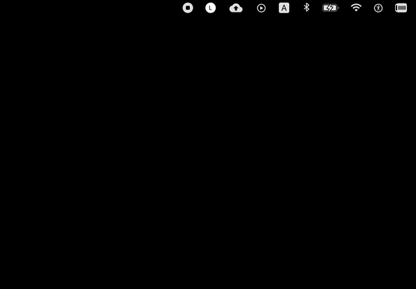

# lPoint

**About The App**

MacOs Vocabulary app helps you learn and organize English words efficiently.

```bash
npm install             # Install all dependencies
npm run electron:serve  # Serve with electron
npm run electron:build  # Build for production

npm run express:dev # Development mod for server api . dir => _express
```

#####  **Note :** See folder **docs/postman** for services

<p align="center">
    
</p>